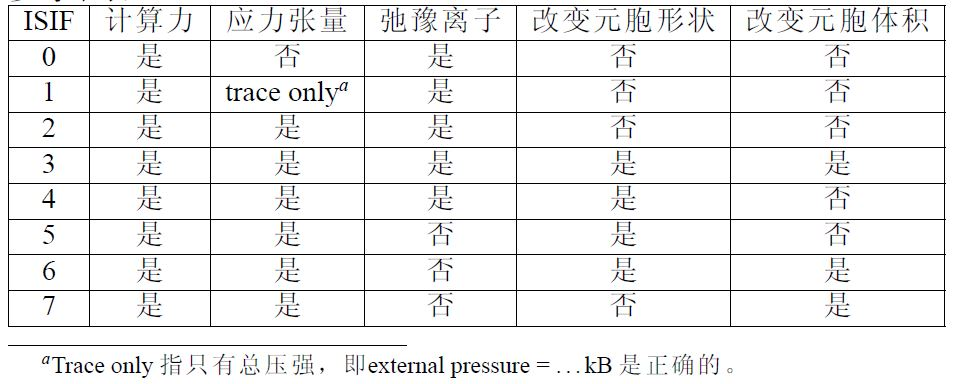

## 前言
由于正在搞毕设，需要做结构优化，自然第一个想到的就是比较流行的商业软件VASP，用过了几次，虽然结果不太好（多半是我自己模型的问题），但还是写在这里记录一下。最重要的就是不懂要查看手册[官网手册](https://www.vasp.at/wiki/index.php/The_VASP_Manual)（一定要多看手册！多看手册！多看手册！）。

## 正文

VASP的主要输入、输出文件有四个：

INCAR、POSCAR、POTCAR、KPOINTS、OUTCAR、CONTCAR、OSZICAR（由于仅涉及结构优化，不考虑能带、电子态密度等的计算，暂时先说这些）

##  INCAR文件
文件中输入一些控制整个计算过程的参数，

### SYSTEM
  * SYSTEM 是对整个计算的注释、说明，后面可以随便写，但是尽量不要写中文。

* SYSTEM=Ar Structure Optimization #注释

### EDIFF EDIFFG NSW NELM NELMIN POINT IBRION  ISIF 
> 控制电子步和离子步收敛的参数。

>先解释一下电子步和离子步的概念： 一般来讲，电子步就是电子自洽迭代的次数（默认60），离子步是离子驰豫的步数。

>结构优化也叫**结构迟豫**。是指对整个输入体系的坐标进行调整，得到一个相对稳定的基态结构。结构优化分**原子迟豫**和**电子迭代**两个嵌套的过程，每次计算中都进行原子迟豫和电子迭代计算（电子迭代嵌套在原子迟豫中），达到**原子迟豫收敛标准**时进行下一步计算，直到达到自动中断或者**最大原子迟豫步数**。（通常以前后两次总自由能之差或 原子所受最大的力 作为原子迟豫的收敛标准，电子自洽迭代计算以总能作为收敛标准，默认为10-4，因电子迭代的嵌套特性，以及电子迭代和原子迟豫的收敛速度不同，最终以原子迟豫最大步数作为强制停止参数）

* EDIFFG：原子迟豫收敛标准，力作为收敛标准:EDIFFG为负, 一般-0.01到-0.05之间；能量作为标准:EDIFFG 为正, 一般0.001-0.0001

* EDIFF：电子迭代收敛标准 1E-4或者1E-5即可

* NSE：离子步的最大步数

* NELM：电子步自洽迭代最大步数，默认为60

* NELMIN：最小的电子步迭代次数，默认2

* POINT：IBRION=1,2,3时表示原子每步移动的大小，默认为0.5。即是使用准牛顿法、共轭梯度法、最速下降法优化原子位置时需要设置的步长

* IBRION：离子驰豫方式，可以去3（初始结构很差），2（CG方法优化，较慢，找到全剧最小的可能性大），1（准牛顿方法 速度快 适合结构与标准模型接近），-1（原子不移动，是IBRION的默认值，NSW=0是原子也不会移动，静态自洽的时候使用）

*  ISIF 控制原子迟豫过程中晶胞的变化情况 IBRION=0时默认0,其他情况默认2，常用2,3 具体如图：

 

### ISMEAR SIGMA PREC
* ISMEAR 每个波函数的部分占有数 （还不是很理解）金属使用1,2，半导体使用-5，结构优化不能用-5

* SIGMA（展开的宽度）的话选定某一个不是很夸张的值应该都可以，如果对于大体系（几百个原子那种）可以选的大一些，到0.1或者再大一些，要是小胞的话可以0.05或者0.01之类的。

* SIGMA的取值和ISMEAR息息相关

* ISMEAR = -5 (对于所有体系),SIGMA的值可以忽略,也可以不管(VASP会自动略过)

* SIGMA的取值和KPOINTS密切相关,Kpoints确定之后,测试SIGMA取值合理性。标准是: grep ‘entropy T’ OUTCAR 得出的能量除以体系中原子的数目,小于0.001 eV 合格 

* 对于分子,原子体系(也就是你把分子或者原子放到一个box里面),K点只有一个Γ点取ISMEAR=0，SIGMA必须要用很小的值,如0.01
* MP方法(ISMEAR=1..N):SIGMA取值太大,计算出来的能量可能不正确;SIGMA取值越小,计算越精确,需要的时间也就越多 

>从经验上来说:对于金属体系,使用MP方法(ISMEAR=1..N)时,SIGMA= 0.10 足够了,官网给的参考值是0.20。

>对于高斯展宽Gaussian Smearing (ISMEAR = 0), 对于大部分的体系都能得到理想的结果 

>SIGMA取值比较大的时候会得到与MP方法相近的误差;但是误差多大,GS方法不可以得到,而MP方法可以。从这一点上来说,MP要比GS好些; 

>使用GS方法的时候(ISMEAR=0),SIGMA的数值要测试下,保证grep "entropy T" OUTCAR |tail -1结果平均到每个原子上小于0.001 eV也就是1meV。不想测试,对于金属体系:SIGMA=0.05是一个很安全的选择 

>对于半导体和绝缘体,SIGMA取值要小,SIGMA = 0.01 – 0.05 之间也是很安全的。

* PREC 计算精度
   

### ISTART ICHARG INIWAV
* ISTART 初始波函数产生方法  

   默认存在WAVECAR时取1,否则0 

    ISTART=0,根据INIWAV决定初始波函数的产生方法

    ISTART=1,波函数从WAVECAR文件读入

* INIWAV初始波函数产生方法 

    仅在ISTARTT=0生效 

    0 凝胶波函数 
    1[默认]随机数

* ICHAGE初始电荷密度产生方法 

    默认ISTART=0取2否则取0 

    0从初始波函数计算 

    1从CHGCAR(上次输出的电荷密度)读入 

    +10非自洽运算,电荷密度在计算过程中保持不变 

    如1+10=11时，电荷密度保持CHGCAR中的值不变,适用于给定电荷密度求能级本征值(计算能带,输出EIGENVAL文件)和态密度(DOS,输出DOSCAR文件),用于能带计算

### ISPIN MAGMOM
由体系决定
* ISPIN=0(默认) 不考虑自旋 
* ISPIN=2 考虑自旋，电子分为α,β电子计算,考虑磁性 
* ISPIN=2时,可指定体系的初始磁矩MAGMOM

输入格式：

    MAGMOM=原子种类1*自旋磁矩 原子种类2*自旋磁矩 ...

对于简单体系来说，MAGMOM可以采用默认值；

MAGMOM设置的时候，初始值不要求与实验值完全一致，一般取大些（1.5倍）比较好

## POSCAR

> POSCAR文件主要是存放待计算结构的信息 格式如下
 
    AlN bulk (Title) 首行注释
    1.0   缩放系数
    3.11  0.00  0.00    第一个平移矢量a方向
    -1.56   2.69  0.00  第二个平移矢量b方向
    0.00    0.00  4.98  第三个平移矢量c方向
    Al    N 原子种类
    2   2   单胞内原子数目
    Selective dynamics [可选]有对构型(原子坐标)进行部分优化，没有,则全优化
    Direct  Direct分数坐标,Car实际坐标单位为埃
    0.667   0.333     0.000    T   T   T  T表示对此方向优化，F表示对此方向不优化
    0.333   0.667     0.500    T   T   T
    0.667   0.333     0.382    T   T   T
    0.333   0.667     0.882    F   F   F

## POTCAR

主要是演示文件  来任务了 今天先写到这里