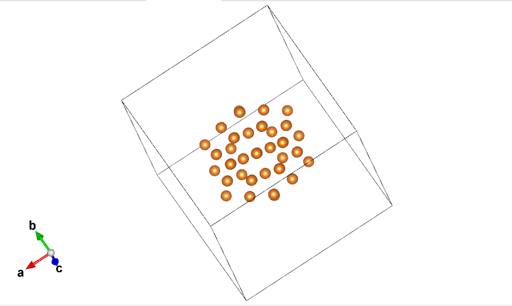
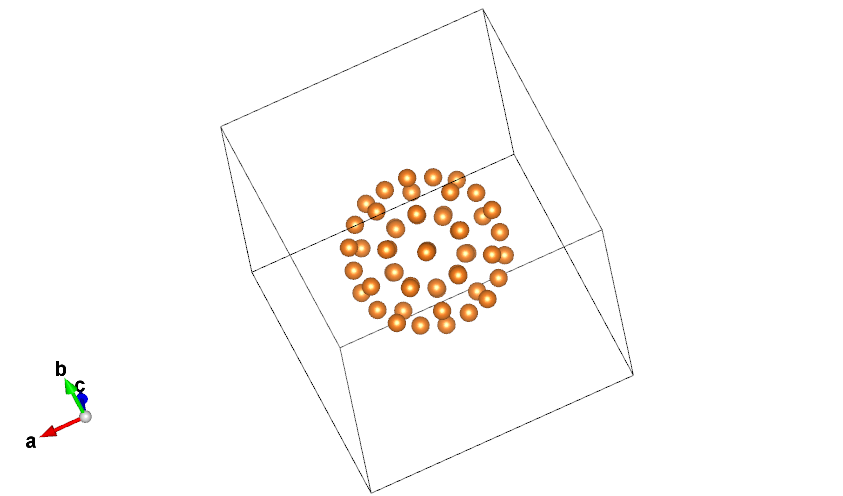

# 哈哈哈

经过老夫的一番不(hu)懈(luan)努(you)力(hua)， 终于有了一点进展了  所以一定要小小的记录一下  嘿嘿嘿~~~

上图：

上图即为优化后的Mg元素的正二十面体 虽然 文章上Mg的55个原子的结构并不是正二十面体（谁让人家的能量低 我的比他搞了1呢） 但是至少有了搞下去的信心  虽然我的目标也不是超过人家  只要无限接近就行啦嘿嘿嘿

说也怪 我这程序一遍跑下一个完整的结构 优化的倒不如两边夹着产生的结构优化的好 感觉还是哪里有问题  但是这个也同样启发我  ：

如果我不按最开始的套路 直接一股脑的吧x y z遍历完 而是分成两段 或者三段 然后按照不同的方向行进 （就有点像一个环形的水槽 在不同方向倒上不同颜色的液体 最后液体也会沾满整个环形槽）  说不定就能产生出很多 在同一条件下生成的相同原子数的结构了  这样也就有了对比  ！ 

不错 明天要试试 ~ 为什么是明天呢 因为昨天晚上我就稍稍晚了一个小时上床睡觉  今天就特别不舒服  所以今天不能熬太晚 但是一旦我开始弄这个想法 那势必不弄完心难受 至少也得把程序的大体修改出来 就很难受 所以还是明天吧 

但是今天下午脑海里凭空冒出很多想法还是不错的  已经即使的记了下来 舍得过后拍大腿。。

对了 今天弄了半天Xshell也没登陆组里的集群 不知道咋回事  等下再研究研究 然后 弄一个XSHell的文章出来 （虽然你们可能直接就弄出来了  但我还是要写的 因为要记录我的错误出在哪）

讲实话  我最近登录集群都靠git bash。。。。。  好久没登陆虚拟机上了Linux了 我居然有点想念我那个上面的vim配置了 （主要git bash 那个终端加vim真的不要太丑 虽然把我的vimrc拷贝过来了 但还是不如Linux上的那个）

在立一个flag ：

等忙完之后  我要在折腾一边vim 重新配置一下 弄一弄插件啥的  在写了文章 （我都重装vim好几遍了 前几次都是想让vim同时支持python and python3 but after a couple of times finally i realize that only can one exist in vim, which was shame to know it for a long time after......

And I still remember that content and bg music things and now i am gonna do it~
